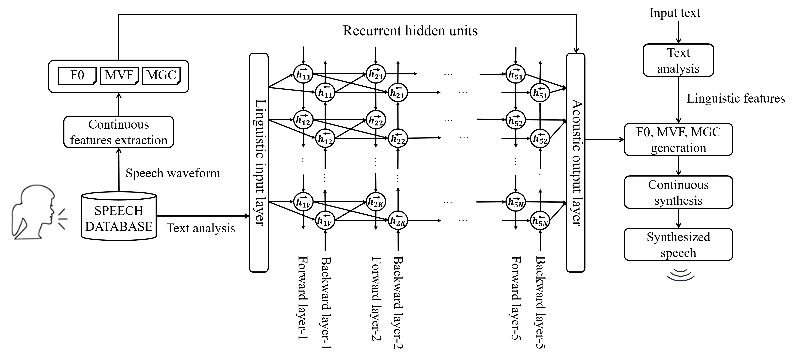

# Fully Text-To-Speech Demo using Continuous Vocoder


[](https://travis-ci.org/malradhi/merlin) [](https://github.com/malradhi)


This repository contains a TTS system based on Continuous vocoder developed at the Speech Technology and Smart Interactions Laboratory (SmartLab), Budapest University of Technology and Economics.

As a difference with other traditonal statistical parametric vocoders, continuous model focuses on extracting continuous parameters:

* Fundamental Frequency (F0)
* Maximum Voiced Freuqency (MVF)
* Mel-Generalized Cepstral (MGC) 

<p align="center"></p>

## Continuous DNN-TTS

Besides feed-forward neural networks, this demo also supports recurrent neural networks (RNNs):

* Long short-term memory  (LSTM) 
* Bidirectional LSTM     (BLSTM)
* Gated recurrent units  (GRU)


## Installation

You need to have installed:
* compiles: ```bash tools/compile_tools.sh```
* python dependencies: ```pip install -r requirements.txt```
* festival: ```sudo apt-get install festival```
 


## Run demo

To run this demo, `./egs/slt_arctic/s1/run_full_voice.sh` script will:


### 1. Check for missing packages

The first step is to check continuous vocoder requirements in your system.
```sh
./01_chk_rqmts.sh
```

### 2. Setting up
The second step is to run setup as it creates directories and downloads the required training data files.

```sh
./02_setup.sh slt_arctic_full
```
OR
```sh
./02_setup.sh bdl_arctic_full
```

It also creates a global config file: `conf/global_settings.cfg`, where default settings are stored.

<p><strong>Directory structure:</strong> </p>


```none
.
├── misc
│   └── scripts
│       └── vocoder
│           ├── continuous        
│           └── ...
├── egs                     
│   └── slt_arctic
│       └── s1
│           ├── run_full_voice.sh
│           ├── conf
│           ├── scripts
│           └── experiments
│               └── slt_arctic_full                      
│                   ├── acoustic_model                  
│                   ├── duration_model                        
│                   └── test_synthesis
├── src
└── tools               
```


 
### 3. Prepare config files

At this point, we have to prepare two config files to train DNN models
- Acoustic Model
- Duration Model

To prepare config files:
```sh
./03_prepare_conf_files.sh conf/global_settings.cfg
```

### 4. Train duration model

To train duration model:
```sh
./04_train_duration_model.sh conf/duration_slt_arctic_full.conf
```
OR
```sh
./04_train_duration_model.sh conf/duration_bdl_arctic_full.conf
```

### 5. Train acoustic model

To train acoustic model:
```sh
./05_train_acoustic_model.sh conf/acoustic_slt_arctic_full.conf
```
OR
```sh
./05_train_acoustic_model.sh conf/acoustic_bdl_arctic_full.conf
```

### 6. Synthesize speech

To synthesize speech with continuous vocoder:
```sh
./06_run_merlin.sh conf/test_dur_synth_slt_arctic_full.conf conf/test_synth_slt_arctic_full.conf
```
OR
```sh
./06_run_merlin.sh conf/test_dur_synth_bdl_arctic_full.conf conf/test_synth_bdl_arctic_full.conf
```

The synthesised waveforms will be stored in: ```/<experiment_dir>/test_synthesis/wav```


 
  
<p><br /> 
<br /></p>


## Test TTS demo with continuous vocoder

If you want to test the trained version, `./tts_demo.sh` script will:

- Create the txt directory in ```experiments/slt_arctic_full/test_synthesis```.
- Ask you to enter a new sentenece.
- Synthesise speech with continuous vocoder 


<p><br /> 
<br /></p>


<p><br /> 
<br /></p>

Contact Us
----------

Post your questions, suggestions, and discussions to [GitHub Issues](https://github.com/malradhi/merlin/issues).

[Speech Technology and Smart Interactions Laboratory](http://smartlab.tmit.bme.hu/index-en)


<p><br /> 
<br /></p>

Citation
--------

<p>If you publish work based on <strong>Continuous TTS</strong>, please cite: </p>

* Al-Radhi M.S., Csapó T.G., Németh G. (2020) conTTS: Text-to-Speech Application using a Continuous Vocoder. In:  Accepted  to ISSP 2020. [Audio Samples](https://malradhi.github.io/conTTS/).</p>

* Al-Radhi M.S., Csapó T.G., Németh G. (2020) [Continuous Noise Masking Based Vocoder for Statistical Parametric Speech Synthesis](https://www.jstage.jst.go.jp/article/transinf/E103.D/5/E103.D_2019EDP7167/_pdf/-char/en). IEICE Transactions on Information and Systems, E103.D(5), pp. 1099-1107. [Audio Samples](http://smartlab.tmit.bme.hu/cNM2019).</p>

* Al-Radhi M.S., Csapó T.G., Németh G. (2017) [Deep Recurrent Neural Networks in Speech Synthesis Using a Continuous Vocoder](https://link.springer.com/content/pdf/10.1007%2F978-3-319-66429-3_27.pdf). In: Karpov A., Potapova R., Mporas I. (eds) Speech and Computer. SPECOM 2017. Lecture Notes in Computer Science, vol 10458. Springer, Cham, Hatfield, UK.</p>


